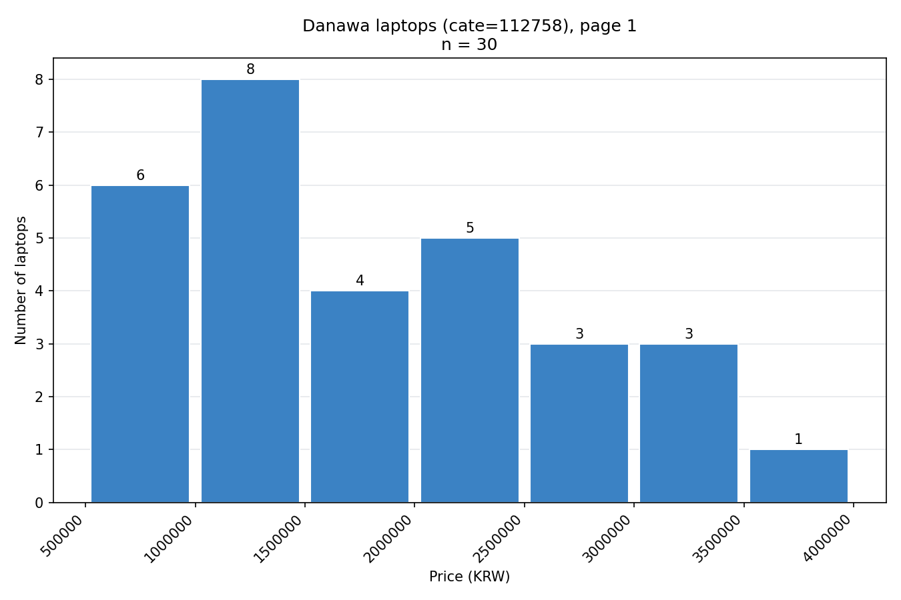
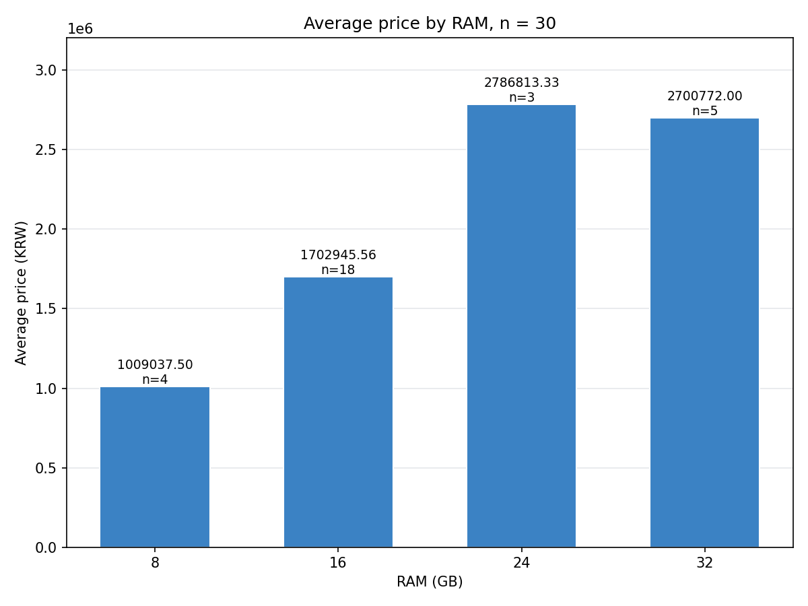
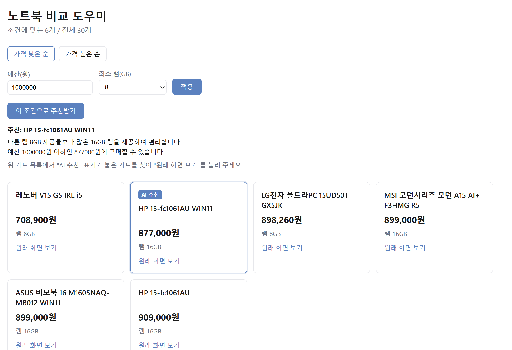

# 미니3 보고서 — 노트북 비교 도우미

작성 : 은별 · 배포 주소 : https://miniproject3-sage.vercel.app · 저장소 : https://github.com/eunbel22/mini_project_3_goat

## 요약
- 무엇을 : 예산(원)·최소 램(GB)을 넣으면 정제된 30개 중 조건에 맞는 후보가 남고, AI가 그 안에서 한 대를 이유와 함께 고르는 화면
- 무엇을 확인했나 : AI 추천 세 경우(M14) 모두 후보 안에서 골랐고 가격·램이 데이터와 같았다
- 남은 것 : 짝 테스트는 한 사람·한 번뿐이라, 같은 과제 카드로 다른 회원 두세 명에게 더 해 봐야 한다

## 1. 문제와 대상
- 누가 : 컴퓨터 용어에 익숙하지 않은 직장인. 노트북 예산을 100만 원으로 정해 두고 고르는 중
- 무엇이 어렵나 : 여러 탭을 오가며 비교하다 용어를 몰라 못 고른다

## 2. 데이터와 정제
| 항목 | 내용 |
|---|---|
| 출처 | 다나와 노트북 전체(cate=112758) 인기순 1페이지 — ?page=2 는 1페이지를 반복해 고유 상품은 30개 |
| 수집 시점 | 2026-09-28 15:53 |
| 행 수 | 원본 60 -> 정제 30 · 뺀 행 30 (모두 detail_url 중복) |
| 바꾼 규칙 | 가격 1,329,990원 -> 1329990 (원) · 램 8GB -> 8 |
| 원문과 대조 | 상세 화면 표본 3행 9칸 중 9칸 일치 (단 0행과 30행은 같은 상품) |

다시 모으려면 : scripts/ 폴더 02~07번을 순서대로 실행(자세한 순서·주의점은 notes.md 참고)

## 3. 탐색 — 그림 두 장
### 그림 1. 가격은 어느 구간에 모이나

- 관찰 : 1,000,000–1,500,000원 미만 구간이 8개로 가장 많다
- 대조한 숫자 : 일곱 구간 합 6+8+4+5+3+3+1 = 30 · 정제 행 수와 같음
- 해석 : 100만 원 미만은 6개뿐이라, 이 목록 안에서 예산 100만 원으로는 고를 폭이 좁을 수 있다
- 이 자료로 알 수 없는 것 : 인기순 1페이지 30개 밖의 노트북 가격 분포와, 수집 시점 이후의 가격

### 그림 2. 램마다 평균 가격이 다른가

- 관찰 : 32GB 평균 2,700,772.00원이 24GB 평균 2,786,813.33원보다 낮다 - 램이 많을수록 비싸다고 할 수 없다
- 대조한 숫자 : 램별 개수 합 4+18+3+5 = 30 · 24GB 그룹 손 검산 합 8,360,440 · 평균 2,786,813.33 일치 · 평균 순위와 중앙값 순위 모두 24 > 32 > 16 > 8
- 해석 : 이 표본에서는 램 용량만으로 가격을 가늠하기 어려울 수 있다 - 24GB는 3개뿐이고 그중 최고가 1개(3,719,440원)가 들어 있다
- 이 자료로 알 수 없는 것 : 이 그림은 램과 가격만 보여 주므로, 램이 가격을 정하는지나 다른 사양과의 관계는 알 수 없다

## 4. 해결 방식과 AI 적용점
| 누가 | 하는 일 |
|---|---|
| 코드 | 예산·최소 램으로 후보를 거르고, 후보가 없으면 AI를 부르지 않고 안내를 띄운다 |
| AI (Gemini 무료 API, gemini-3.5-flash-lite) | 후보 최대 5개 안에서 한 대를 고르고 이유 두 줄을 쓴다 - 표의 price·ram_gb만 쓰게 했다 |
| 사람 | 이유의 숫자를 원래 데이터와 대 본다 (M14 검증표) |
- AI에 보내지 않는 것 : 개인 식별값·열쇠

## 5. 구현 결과

- 배포 주소에서 동작 : 필터 · 후보 없음 안내 · AI 추천 · 근거 영역
- 예시 : 예산 1,000,000·최소 램 8 조건이면 30개 중 6개가 남는다(M10)
- AI 검증 : M14 세 경우(정상·후보 1개·후보 없음) 모두 후보 안에서 골랐고 가격·램이 데이터와 같았다 · 이유 첫 줄은 다른 후보와 비교하는 문장으로 나온다(M19)

## 6. 측정과 테스트
- 이벤트 도착 : select_item을 2번 눌러 DebugView 2번 도착(다른 이벤트는 notes.md M17 참고)
- 짝 테스트 : 과제를 끝냈다 · "AI 추천" 카드의 "원래 화면 보기"를 누르기 전에 오래 머물렀다
- 한 곳 개선 : 추천 결과 아래 안내 한 줄 추가 → 다시 해 보니 머문 자리 없이 끝났다

## 7. 한계와 다음 단계
- 한계(데이터) : 다나와 인기순위 1페이지에서 뽑은 고유 상품 30개이고, 가격은 수집 시점(2026-09-28 15:53) 값이라 지금과 다를 수 있다
- 한계(표본) : 같은 조건에서도 추천이 가끔 달라진다(5번 중 1번) - temperature 0이어도 pick까지 100% 보장되지 않는다
- 한계(테스트) : 짝 테스트는 한 사람 · 한 번이다
- 다음 단계 : ?page= 가 실제로 페이지를 안 넘기는 문제를 다른 방법으로 해결해서, 1페이지 30개 밖 상품도 더 모은다
- 다음 단계 : 같은 과제 카드로 다른 회원 두세 명에게 더 해 보게 한다
- 다음 단계 : 실제 회원 반응은 게시 뒤 apply_filter·view_recommendation_result·select_item 이벤트로 본다
